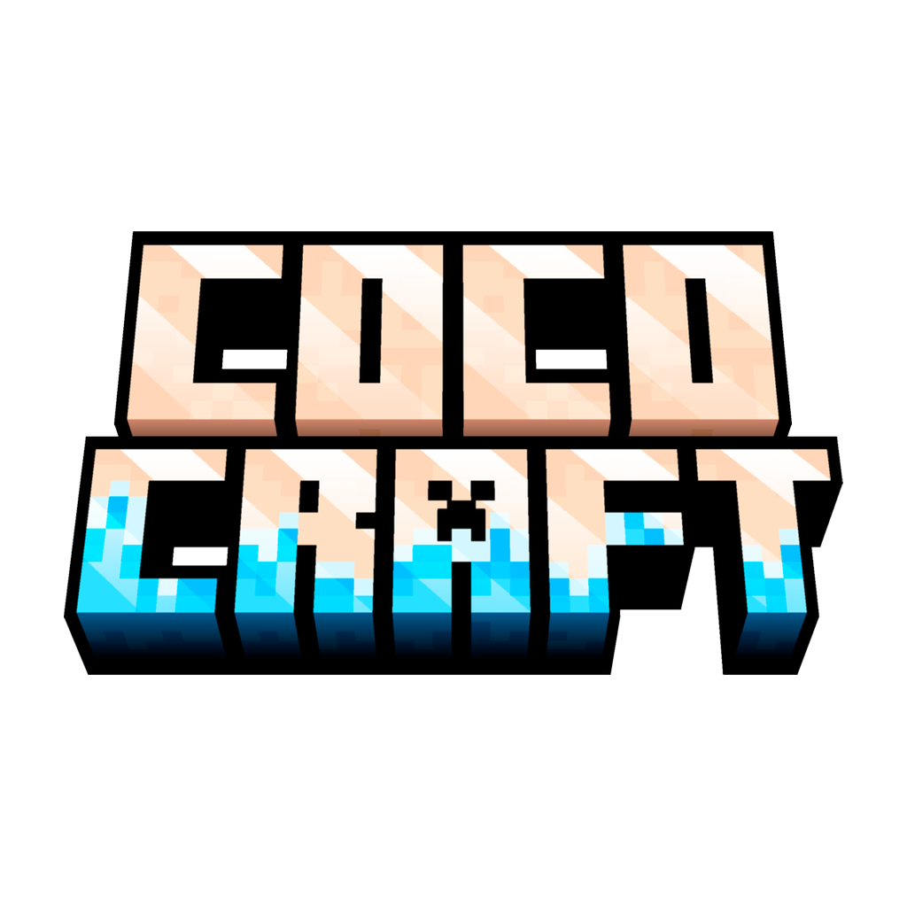

  

<!-- Botones principales (centrados) -->

  <!-- Discord -->
  
  <!-- IP (no tiene link real, puedes apuntar a tu web /join o docs) -->
  

<!-- Redes sociales (colores de marca) -->

  <!-- TikTok -->
  
  <!-- Instagram -->
  
  <!-- X/Twitter -->
  

---
<h2 align="center">ℹ️ About</h2>

**Official CocoCraft Github**. 

Here we design, document, and maintain the bots and tools that keep the community thriving—verification, moderation, tickets, economy, and live server status.

Our goal is a smooth, low-latency **Discord ↔ Minecraft** experience.  
We iterate quickly, learn in public, and keep reliability and security front and center.

Public repositories serve as a showcase (docs, screenshots, roadmaps), while **production code remains private**.

**Maintainers:** Cheese & Moonky

---

<h2 align="center">📌 Server Quick Facts</h2>

  
  
  
  
  
  
  
  

<h2 align="center">🔥 Top Bots</h2>

<table>
  <tr>
    <!-- #2 LEFT -->
    <td valign="top" align="center" width="33%">
       
      
      <h3 style="margin:6px 0">CocoCraft Verification</h3>
      Roles & DiscordSRV sync  
      
  
  
    </td>
    <td valign="top" align="center" width="33%">
       
      
      <h3 style="margin:6px 0">CocoCraft Bot</h3>
      Main “mother” bot · Discord ↔ Minecraft  
      <a href="https://github.com/CocoCraft-Minecraft-Server/cococraft-bot-public">
       
  
    </td>
   <!-- #3 RIGHT -->
<td valign="top" align="center" width="33%">
   
  
  <h3 style="margin:6px 0">CocoRadio</h3>
  In development &nbsp;  
  
  
</td>
  </tr>
</table>

<h2 align="center">🧰 Tech & Tools</h2>

  

  
  
  
  
  

---
